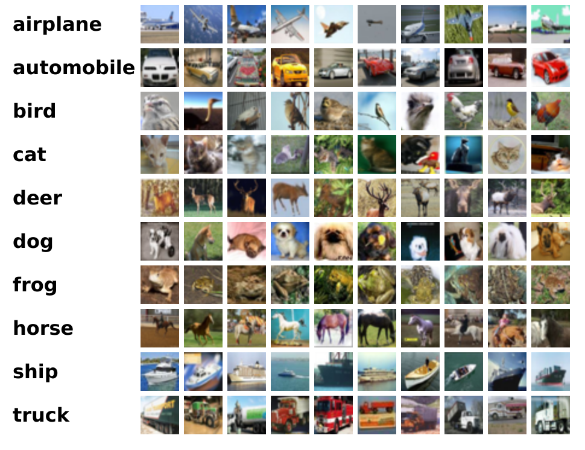

# Task2 进阶任务 HPO+NAS

## Task 2.1

### CIFAR10简介

CIFAR10数据集共有60000张分辨率为32*32的彩色图像，分为十类，每类都有6000张图像。

50000张图像构成训练集，10000张图像构成测试集。



### 实现流程

我们使用PyTorch编写卷积神经网络来解决这项图像分类任务。

大体流程如下：

1. 使用torchvision下载数据集，读取数据集
2. 定义解决该问题的卷积神经网络
3. 训练神经网络
4. 测试神经网络

代码中的神经网络有两个卷积层：

1. 第一层，3个输入（RGB），6个输出。
2. 第二层，6个输入，16个输出。

池化层通过`torch.nn.MaxPool2d`来创建。

然后定义三个全连接函数：
1. 第一个，将16\*5\*5个节点连接至120个节点。
2. 第二个，将120个节点连接到84个节点。
3. 第三个，将84个节点连接到10个节点，即对应分类。

激活函数全程使用Relu函数。

误差函数使用交叉熵函数，优化方法使用SGD。


### 实验配置

使用Anaconda环境下的Python3.8，使用PyCharm运行程序。

设置程序不使用GPU，只用CPU完成训练。

### 代码分析

我们利用了`torch.nn`模块定义了本任务的神经网络。


```python
class NeuralNet(nn.Module):
    def __init__(self):
        super(NeuralNet, self).__init__()
        self.conv1 = nn.Conv2d(3, 6, 5)
        self.pool = nn.MaxPool2d(2, 2)
        self.conv2 = nn.Conv2d(6, 16, 5)
        self.func1 = nn.Linear(16 * 5 * 5, 120)
        self.func2 = nn.Linear(120, 84)
        self.func3 = nn.Linear(84, 10)

    def forward(self, x):
        x = self.pool(F.relu(self.conv1(x)))
        x = self.pool(F.relu(self.conv2(x)))
        x = x.view(-1, 16 * 5 * 5) # -1 means uncertain number
        x = F.relu(self.func1(x))
        x = F.relu(self.func2(x))
        x = self.func3(x)
        return x

```

而训练过程中，使用PyTorch的写法是这样的：

```python
def train(trainloader, path):
    neuralnet = NeuralNet()
    criterion = nn.CrossEntropyLoss()
    optimizer = optim.SGD(neuralnet.parameters(), lr=0.001, momentum=0.9)
    for epoch in range(10):
        running_loss = 0.0
        for i, data in enumerate(trainloader, 0):
            inputs, labels = data
            # training template for PyTorch
            optimizer.zero_grad()
            outputs = neuralnet(inputs)
            loss = criterion(outputs, labels)
            loss.backward()
            optimizer.step()

            running_loss += loss.item()

            if i % 2000 == 1999:
                print('[%5d, %5d] loss = %.5f' % (epoch + 1, i + 1, running_loss / 2000))
                running_loss = 0.0

    torch.save(neuralnet.state_dict(), path)
    print('Training Finished')
```

### 结果分析

经10个epoch的训练，最终输出结果如下：

```
C:\Users\12058\anaconda3\python.exe C:/Users/12058/Documents/GitHub/nni-learning/task2/2.1/main.py
[    1,  2000] loss = 2.16590
[    1,  4000] loss = 1.82480
[    1,  6000] loss = 1.64638
[    1,  8000] loss = 1.56156
[    1, 10000] loss = 1.49378
[    1, 12000] loss = 1.46539
[    2,  2000] loss = 1.39108
[    2,  4000] loss = 1.38308
[    2,  6000] loss = 1.36254
[    2,  8000] loss = 1.30314
[    2, 10000] loss = 1.30563
[    2, 12000] loss = 1.26935
[    3,  2000] loss = 1.21411
[    3,  4000] loss = 1.21809
[    3,  6000] loss = 1.17786
[    3,  8000] loss = 1.18651
[    3, 10000] loss = 1.16956
[    3, 12000] loss = 1.16728
[    4,  2000] loss = 1.10504
[    4,  4000] loss = 1.11141
[    4,  6000] loss = 1.07836
[    4,  8000] loss = 1.10194
[    4, 10000] loss = 1.07333
[    4, 12000] loss = 1.06928
[    5,  2000] loss = 0.98897
[    5,  4000] loss = 1.01186
[    5,  6000] loss = 1.01296
[    5,  8000] loss = 1.01628
[    5, 10000] loss = 1.02610
[    5, 12000] loss = 1.03693
[    6,  2000] loss = 0.94843
[    6,  4000] loss = 0.94470
[    6,  6000] loss = 0.96298
[    6,  8000] loss = 0.96035
[    6, 10000] loss = 0.98843
[    6, 12000] loss = 0.96657
[    7,  2000] loss = 0.87795
[    7,  4000] loss = 0.90013
[    7,  6000] loss = 0.91402
[    7,  8000] loss = 0.94256
[    7, 10000] loss = 0.93912
[    7, 12000] loss = 0.91624
[    8,  2000] loss = 0.84444
[    8,  4000] loss = 0.85796
[    8,  6000] loss = 0.90461
[    8,  8000] loss = 0.89855
[    8, 10000] loss = 0.89341
[    8, 12000] loss = 0.89116
[    9,  2000] loss = 0.79060
[    9,  4000] loss = 0.83296
[    9,  6000] loss = 0.84468
[    9,  8000] loss = 0.85216
[    9, 10000] loss = 0.86738
[    9, 12000] loss = 0.87915
[   10,  2000] loss = 0.76653
[   10,  4000] loss = 0.80672
[   10,  6000] loss = 0.82791
[   10,  8000] loss = 0.80691
[   10, 10000] loss = 0.83649
[   10, 12000] loss = 0.84138
Training Finished
Accuracy of plane: 81.14%
Accuracy of car: 92.10%
Accuracy of bird: 74.58%
Accuracy of cat: 47.94%
Accuracy of deer: 65.08%
Accuracy of dog: 61.28%
Accuracy of frog: 71.88%
Accuracy of horse: 73.24%
Accuracy of ship: 86.18%
Accuracy of truck: 66.52%
Testing Finished

Process finished with exit code 0

```
可以看出，损失值总体稳定下降，对车、飞机、船等图像分类准确率较高，而对猫、狗、卡车等图像的准确率较不理想。

如何提高部分不理想的分类准确率？请看Task 2.2......


## Task 2.2

to be continued...